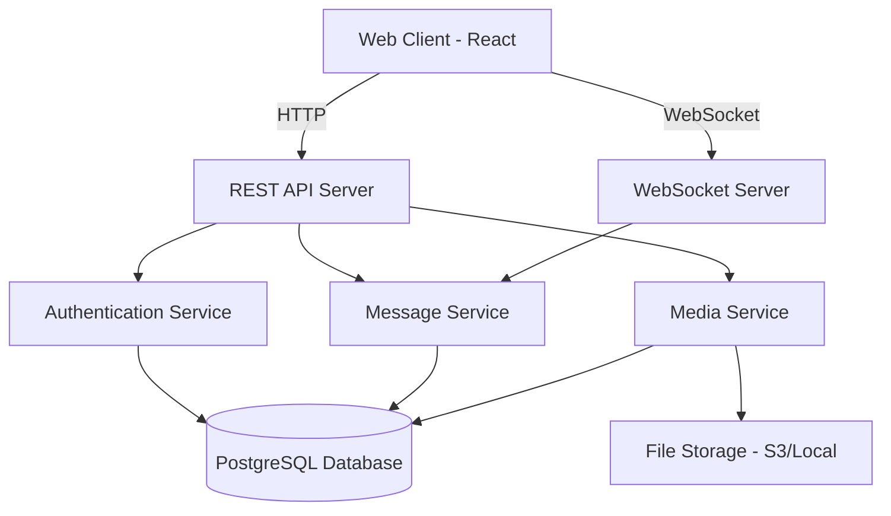

# Design Document

## Overview

The Telegram clone is a real-time messaging application built with a client-server architecture. The system uses WebSocket connections for real-time message delivery, REST APIs for user management and media uploads, and a relational database for data persistence. The application will be built using Node.js/TypeScript for the backend, React for the web client, and PostgreSQL for data storage.

## Architecture

### High-Level Architecture



### Technology Stack

- **Backend**: Node.js with TypeScript, Express.js
- **Real-time Communication**: Socket.io
- **Database**: PostgreSQL with TypeORM
- **File Storage**: AWS S3 or local file system
- **Authentication**: JWT tokens
- **Encryption**: TLS for transport, AES-256 for data at rest

## Components and Interfaces

### 1. Authentication Service

Handles user registration, login, and session management.

**Interface:**
```typescript
interface AuthService {
  registerUser(phoneNumber: string): Promise<VerificationSession>;
  verifyCode(sessionId: string, code: string): Promise<AuthToken>;
  login(phoneNumber: string, password: string): Promise<AuthToken>;
  validateToken(token: string): Promise<User>;
  refreshToken(refreshToken: string): Promise<AuthToken>;
}

interface VerificationSession {
  sessionId: string;
  phoneNumber: string;
  expiresAt: Date;
}

interface AuthToken {
  accessToken: string;
  refreshToken: string;
  expiresIn: number;
}
```

### 2. Message Service

Manages message creation, delivery, and retrieval.

**Interface:**
```typescript
interface MessageService {
  sendMessage(senderId: string, recipientId: string, content: MessageContent): Promise<Message>;
  sendGroupMessage(senderId: string, groupId: string, content: MessageContent): Promise<Message>;
  editMessage(messageId: string, userId: string, newContent: string): Promise<Message>;
  deleteMessage(messageId: string, userId: string, deleteForEveryone: boolean): Promise<void>;
  getMessages(chatId: string, userId: string, limit: number, offset: number): Promise<Message[]>;
  markAsRead(messageId: string, userId: string): Promise<void>;
  searchMessages(userId: string, query: string, chatId?: string): Promise<Message[]>;
}

interface Message {
  id: string;
  senderId: string;
  recipientId?: string;
  groupId?: string;
  content: MessageContent;
  status: MessageStatus;
  createdAt: Date;
  updatedAt?: Date;
  isEdited: boolean;
  isDeleted: boolean;
}

interface MessageContent {
  text?: string;
  mediaId?: string;
  mediaType?: 'image' | 'video' | 'audio' | 'document';
}

enum MessageStatus {
  SENT = 'sent',
  DELIVERED = 'delivered',
  READ = 'read'
}
```

### 3. Media Service

Handles file uploads, storage, and retrieval.

**Interface:**
```typescript
interface MediaService {
  uploadMedia(file: File, userId: string): Promise<MediaFile>;
  getMedia(mediaId: string): Promise<MediaFile>;
  deleteMedia(mediaId: string, userId: string): Promise<void>;
  generateThumbnail(mediaId: string): Promise<string>;
}

interface MediaFile {
  id: string;
  userId: string;
  filename: string;
  mimeType: string;
  size: number;
  url: string;
  thumbnailUrl?: string;
  uploadedAt: Date;
}
```

### 4. User Service

Manages user profiles, contacts, and online status.

**Interface:**
```typescript
interface UserService {
  createUser(phoneNumber: string, displayName: string): Promise<User>;
  updateProfile(userId: string, updates: ProfileUpdate): Promise<User>;
  getUser(userId: string): Promise<User>;
  searchUsers(query: string): Promise<User[]>;
  addContact(userId: string, contactId: string): Promise<void>;
  removeContact(userId: string, contactId: string): Promise<void>;
  getContacts(userId: string): Promise<User[]>;
  updateOnlineStatus(userId: string, status: OnlineStatus): Promise<void>;
  getOnlineStatus(userId: string): Promise<OnlineStatus>;
}

interface User {
  id: string;
  phoneNumber: string;
  username?: string;
  displayName: string;
  profilePicture?: string;
  bio?: string;
  createdAt: Date;
  lastSeen?: Date;
  isOnline: boolean;
}

interface ProfileUpdate {
  displayName?: string;
  username?: string;
  profilePicture?: string;
  bio?: string;
}

interface OnlineStatus {
  isOnline: boolean;
  lastSeen?: Date;
}
```

### 5. Group Service

Manages group creation, membership, and permissions.

**Interface:**
```typescript
interface GroupService {
  createGroup(creatorId: string, name: string, memberIds: string[]): Promise<Group>;
  addMember(groupId: string, userId: string, newMemberId: string): Promise<void>;
  removeMember(groupId: string, adminId: string, memberId: string): Promise<void>;
  leaveGroup(groupId: string, userId: string): Promise<void>;
  updateGroup(groupId: string, adminId: string, updates: GroupUpdate): Promise<Group>;
  getGroup(groupId: string): Promise<Group>;
  getGroupMembers(groupId: string): Promise<User[]>;
}

interface Group {
  id: string;
  name: string;
  description?: string;
  creatorId: string;
  adminIds: string[];
  memberIds: string[];
  createdAt: Date;
  updatedAt?: Date;
}

interface GroupUpdate {
  name?: string;
  description?: string;
}
```

### 6. Settings Service

Manages user preferences for privacy, notifications, and appearance.

**Interface:**
```typescript
interface SettingsService {
  getUserSettings(userId: string): Promise<UserSettings>;
  updateUserSettings(userId: string, settings: Partial<UserSettings>): Promise<UserSettings>;
  getPrivacySettings(userId: string): Promise<PrivacySettings>;
  updatePrivacySettings(userId: string, privacy: Partial<PrivacySettings>): Promise<PrivacySettings>;
  getNotificationSettings(userId: string): Promise<NotificationSettings>;
  updateNotificationSettings(userId: string, notifications: Partial<NotificationSettings>): Promise<NotificationSettings>;
}

interface UserSettings {
  userId: string;
  privacy: PrivacySettings;
  notifications: NotificationSettings;
  theme: 'light' | 'dark' | 'auto';
  language: string;
  createdAt: Date;
  updatedAt: Date;
}

interface PrivacySettings {
  showOnlineStatus: 'everyone' | 'contacts' | 'nobody';
  showLastSeen: 'everyone' | 'contacts' | 'nobody';
  showProfilePhoto: 'everyone' | 'contacts' | 'nobody';
  allowAddByPhone: boolean;
  allowAddByUsername: boolean;
}

interface NotificationSettings {
  messageNotifications: boolean;
  groupNotifications: boolean;
  mentionNotifications: boolean;
  soundEnabled: boolean;
  vibrationEnabled: boolean;
  showPreview: boolean;
}
```

### 7. Notification Service

Manages notification creation, delivery, and user preferences.

**Interface:**
```typescript
interface NotificationService {
  createNotification(userId: string, notification: CreateNotificationData): Promise<Notification>;
  getNotifications(userId: string, limit?: number): Promise<Notification[]>;
  markAsRead(notificationId: string, userId: string): Promise<void>;
  markAllAsRead(userId: string): Promise<void>;
  deleteNotification(notificationId: string, userId: string): Promise<void>;
  getUnreadCount(userId: string): Promise<number>;
  shouldSendNotification(userId: string, type: NotificationType): Promise<boolean>;
}

interface CreateNotificationData {
  type: 'message' | 'group_invite' | 'contact_request' | 'mention';
  title: string;
  body: string;
  data?: any;
}

interface Notification {
  id: string;
  userId: string;
  type: 'message' | 'group_invite' | 'contact_request' | 'mention';
  title: string;
  body: string;
  data?: any;
  isRead: boolean;
  createdAt: Date;
  updatedAt: Date;
}

type NotificationType = 'message' | 'group' | 'mention';
```

### 8. WebSocket Manager

Handles real-time connections and message broadcasting.

**Interface:**
```typescript
interface WebSocketManager {
  connect(userId: string, socket: Socket): void;
  disconnect(userId: string): void;
  broadcastMessage(recipientIds: string[], message: Message): void;
  broadcastStatusUpdate(userId: string, status: OnlineStatus): void;
  sendNotification(userId: string, notification: Notification): void;
  sendUnreadCountUpdate(userId: string, count: number): void;
}

interface Notification {
  type: 'message' | 'group_invite' | 'contact_request';
  title: string;
  body: string;
  data: any;
}
```

## Data Models

### Database Schema

```sql
-- Users table
CREATE TABLE users (
  id UUID PRIMARY KEY DEFAULT gen_random_uuid(),
  phone_number VARCHAR(20) UNIQUE NOT NULL,
  username VARCHAR(50) UNIQUE,
  display_name VARCHAR(100) NOT NULL,
  profile_picture TEXT,
  bio TEXT,
  password_hash VARCHAR(255),
  is_online BOOLEAN DEFAULT false,
  last_seen TIMESTAMP,
  created_at TIMESTAMP DEFAULT CURRENT_TIMESTAMP,
  updated_at TIMESTAMP DEFAULT CURRENT_TIMESTAMP
);

-- Contacts table
CREATE TABLE contacts (
  user_id UUID REFERENCES users(id) ON DELETE CASCADE,
  contact_id UUID REFERENCES users(id) ON DELETE CASCADE,
  added_at TIMESTAMP DEFAULT CURRENT_TIMESTAMP,
  PRIMARY KEY (user_id, contact_id)
);

-- Groups table
CREATE TABLE groups (
  id UUID PRIMARY KEY DEFAULT gen_random_uuid(),
  name VARCHAR(100) NOT NULL,
  description TEXT,
  creator_id UUID REFERENCES users(id) ON DELETE SET NULL,
  created_at TIMESTAMP DEFAULT CURRENT_TIMESTAMP,
  updated_at TIMESTAMP DEFAULT CURRENT_TIMESTAMP
);

-- Group members table
CREATE TABLE group_members (
  group_id UUID REFERENCES groups(id) ON DELETE CASCADE,
  user_id UUID REFERENCES users(id) ON DELETE CASCADE,
  is_admin BOOLEAN DEFAULT false,
  joined_at TIMESTAMP DEFAULT CURRENT_TIMESTAMP,
  PRIMARY KEY (group_id, user_id)
);

-- Messages table
CREATE TABLE messages (
  id UUID PRIMARY KEY DEFAULT gen_random_uuid(),
  sender_id UUID REFERENCES users(id) ON DELETE SET NULL,
  recipient_id UUID REFERENCES users(id) ON DELETE CASCADE,
  group_id UUID REFERENCES groups(id) ON DELETE CASCADE,
  content_text TEXT,
  media_id UUID,
  status VARCHAR(20) DEFAULT 'sent',
  is_edited BOOLEAN DEFAULT false,
  is_deleted BOOLEAN DEFAULT false,
  created_at TIMESTAMP DEFAULT CURRENT_TIMESTAMP,
  updated_at TIMESTAMP,
  CONSTRAINT check_recipient CHECK (
    (recipient_id IS NOT NULL AND group_id IS NULL) OR
    (recipient_id IS NULL AND group_id IS NOT NULL)
  )
);

-- Media files table
CREATE TABLE media_files (
  id UUID PRIMARY KEY DEFAULT gen_random_uuid(),
  user_id UUID REFERENCES users(id) ON DELETE CASCADE,
  filename VARCHAR(255) NOT NULL,
  mime_type VARCHAR(100) NOT NULL,
  size_bytes BIGINT NOT NULL,
  storage_path TEXT NOT NULL,
  thumbnail_path TEXT,
  uploaded_at TIMESTAMP DEFAULT CURRENT_TIMESTAMP
);

-- Message read receipts table
CREATE TABLE message_receipts (
  message_id UUID REFERENCES messages(id) ON DELETE CASCADE,
  user_id UUID REFERENCES users(id) ON DELETE CASCADE,
  read_at TIMESTAMP DEFAULT CURRENT_TIMESTAMP,
  PRIMARY KEY (message_id, user_id)
);

-- Verification sessions table
CREATE TABLE verification_sessions (
  id UUID PRIMARY KEY DEFAULT gen_random_uuid(),
  phone_number VARCHAR(20) NOT NULL,
  code VARCHAR(6) NOT NULL,
  expires_at TIMESTAMP NOT NULL,
  created_at TIMESTAMP DEFAULT CURRENT_TIMESTAMP
);

-- User settings table
CREATE TABLE user_settings (
  user_id UUID PRIMARY KEY REFERENCES users(id) ON DELETE CASCADE,
  theme VARCHAR(10) DEFAULT 'dark' CHECK (theme IN ('light', 'dark', 'auto')),
  language VARCHAR(10) DEFAULT 'uz',
  created_at TIMESTAMP DEFAULT CURRENT_TIMESTAMP,
  updated_at TIMESTAMP DEFAULT CURRENT_TIMESTAMP
);

-- Privacy settings table
CREATE TABLE privacy_settings (
  user_id UUID PRIMARY KEY REFERENCES users(id) ON DELETE CASCADE,
  show_online_status VARCHAR(10) DEFAULT 'everyone' CHECK (show_online_status IN ('everyone', 'contacts', 'nobody')),
  show_last_seen VARCHAR(10) DEFAULT 'everyone' CHECK (show_last_seen IN ('everyone', 'contacts', 'nobody')),
  show_profile_photo VARCHAR(10) DEFAULT 'everyone' CHECK (show_profile_photo IN ('everyone', 'contacts', 'nobody')),
  allow_add_by_phone BOOLEAN DEFAULT true,
  allow_add_by_username BOOLEAN DEFAULT true,
  created_at TIMESTAMP DEFAULT CURRENT_TIMESTAMP,
  updated_at TIMESTAMP DEFAULT CURRENT_TIMESTAMP
);

-- Notification settings table
CREATE TABLE notification_settings (
  user_id UUID PRIMARY KEY REFERENCES users(id) ON DELETE CASCADE,
  message_notifications BOOLEAN DEFAULT true,
  group_notifications BOOLEAN DEFAULT true,
  mention_notifications BOOLEAN DEFAULT true,
  sound_enabled BOOLEAN DEFAULT true,
  vibration_enabled BOOLEAN DEFAULT true,
  show_preview BOOLEAN DEFAULT true,
  created_at TIMESTAMP DEFAULT CURRENT_TIMESTAMP,
  updated_at TIMESTAMP DEFAULT CURRENT_TIMESTAMP
);

-- Notifications table
CREATE TABLE notifications (
  id UUID PRIMARY KEY DEFAULT gen_random_uuid(),
  user_id UUID REFERENCES users(id) ON DELETE CASCADE,
  type VARCHAR(20) NOT NULL CHECK (type IN ('message', 'group_invite', 'contact_request', 'mention')),
  title VARCHAR(255) NOT NULL,
  body TEXT NOT NULL,
  data JSONB,
  is_read BOOLEAN DEFAULT false,
  created_at TIMESTAMP DEFAULT CURRENT_TIMESTAMP,
  updated_at TIMESTAMP DEFAULT CURRENT_TIMESTAMP
);

-- Indexes for notifications
CREATE INDEX idx_notifications_user_id ON notifications(user_id);
CREATE INDEX idx_notifications_created_at ON notifications(created_at DESC);
CREATE INDEX idx_notifications_unread ON notifications(user_id, is_read) WHERE is_read = false;
```


## Correctness Properties

*A property is a characteristic or behavior that should hold true across all valid executions of a system-essentially, a formal statement about what the system should do. Properties serve as the bridge between human-readable specifications and machine-verifiable correctness guarantees.*

### Authentication Properties

**Property 1: Verification session creation**
*For any* valid phone number, creating a verification session should result in a session record being stored with an expiration time
**Validates: Requirements 1.1**

**Property 2: Successful verification creates account**
*For any* verification session with a correct code, verifying the code should create a new user account and return valid authentication tokens
**Validates: Requirements 1.2**

**Property 3: Invalid phone number rejection**
*For any* string that does not match valid phone number format, registration should be rejected with an error
**Validates: Requirements 1.3**

**Property 4: Incorrect verification code rejection**
*For any* verification session, providing an incorrect code should reject authentication and maintain the session for retry
**Validates: Requirements 1.4**

### Messaging Properties

**Property 5: Message delivery**
*For any* valid message sent between two users, the message should be stored and retrievable by the recipient
**Validates: Requirements 2.1**

**Property 6: Message status progression**
*For any* message, the status should progress from 'sent' to 'delivered' when received, and to 'read' when the recipient marks it as read
**Validates: Requirements 2.2, 2.3, 2.4**

**Property 7: Empty message rejection**
*For any* string composed entirely of whitespace or empty, sending it as a message should be rejected
**Validates: Requirements 2.5**

### Media Properties

**Property 8: Media upload and attachment**
*For any* valid media file (image, video, or document), uploading should store the file and create a message with the media reference
**Validates: Requirements 3.1, 3.2, 3.3**

**Property 9: Media upload error handling**
*For any* media upload that fails, the system should return an error and not create a partial message
**Validates: Requirements 3.5**

**Property 10: Thumbnail generation**
*For any* uploaded image or video, a thumbnail should be generated and accessible
**Validates: Requirements 3.6**

**Property 41: Document upload and metadata**
*For any* valid document file (PDF, DOC, ZIP, etc.), uploading should store the file with proper metadata (name, size, type)
**Validates: Requirements 3.3**

**Property 42: Document download capability**
*For any* uploaded document, recipients should be able to download the original file with correct filename and content
**Validates: Requirements 3.7**

### Group Properties

**Property 11: Group creation with members**
*For any* group created with a list of member IDs, all specified members should be added to the group
**Validates: Requirements 4.1**

**Property 12: Group message broadcasting**
*For any* message sent to a group, all current members of the group should receive the message
**Validates: Requirements 4.2**

**Property 13: Group membership notification**
*For any* user added to a group, a notification should be created for that user
**Validates: Requirements 4.3**

**Property 14: Member removal**
*For any* group member removed by an admin, that member should no longer appear in the group's member list
**Validates: Requirements 4.4**

**Property 15: Group leave**
*For any* user leaving a group, the user should be removed from the member list and notifications should be sent to remaining members
**Validates: Requirements 4.5**

### Online Status Properties

**Property 16: Connection sets online status**
*For any* user connecting to the system, their online status should be set to true
**Validates: Requirements 5.1**

**Property 17: Disconnection sets offline status**
*For any* user disconnecting from the system, their online status should be set to false and last seen timestamp should be updated
**Validates: Requirements 5.2**

**Property 18: Status retrieval**
*For any* user, querying their online status should return the current status and last seen timestamp
**Validates: Requirements 5.3**

**Property 19: Status change broadcasting**
*For any* user's status change, all connected contacts should receive a status update notification
**Validates: Requirements 5.4**

**Property 20: Privacy-filtered status**
*For any* user with privacy settings enabled, non-contacts should not be able to retrieve their online status
**Validates: Requirements 5.5**

### Search Properties

**Property 21: Message search completeness**
*For any* search query, all messages containing the query text should be returned in the results
**Validates: Requirements 6.1**

**Property 22: Chat-specific search filtering**
*For any* search query with a specific chat ID, only messages from that chat should be returned
**Validates: Requirements 6.4**

### Notification Properties

**Property 23: New message notification**
*For any* new message received by a user, a notification should be created for that user
**Validates: Requirements 7.1**

**Property 24: Active chat notification suppression**
*For any* message received in a chat that the user is actively viewing, no notification should be created
**Validates: Requirements 7.3**

**Property 25: Muted chat notification suppression**
*For any* message received in a muted chat, no notification should be created
**Validates: Requirements 7.4**

**Property 26: Notification grouping**
*For any* multiple messages from the same chat, notifications should be grouped by chat ID
**Validates: Requirements 7.5**

**Property 43: Notification delivery**
*For any* created notification, it should be delivered to the user via WebSocket if they are online
**Validates: Requirements 7.1**

**Property 44: Unread count accuracy**
*For any* user, the unread count should accurately reflect the number of unread messages across all chats
**Validates: Requirements 7.1**

**Property 45: Notification settings enforcement**
*For any* user with disabled notification settings, no notifications should be created for the disabled categories
**Validates: Requirements 11.3**

### Security Properties

**Property 27: Data at rest encryption**
*For any* message stored in the database, the content should be encrypted
**Validates: Requirements 8.2**

**Property 28: Message deletion completeness**
*For any* deleted message, querying for that message should return null or not found
**Validates: Requirements 8.3**

**Property 29: Authentication requirement**
*For any* request to access messages, the request must include a valid authentication token or be rejected
**Validates: Requirements 8.4**

### Message Editing Properties

**Property 30: Edit propagation**
*For any* message edited by the sender, all recipients should see the updated content
**Validates: Requirements 9.1**

**Property 31: Edit indicator**
*For any* edited message, the isEdited flag should be set to true
**Validates: Requirements 9.2**

**Property 32: Delete for everyone**
*For any* message deleted for everyone, the message should be marked as deleted and not visible to any recipient
**Validates: Requirements 9.3**

**Property 33: Delete for self**
*For any* message deleted for self only, the message should only be hidden from the deleting user's view
**Validates: Requirements 9.4**

**Property 34: Time-based edit restriction**
*For any* message older than 48 hours, edit attempts should be rejected while delete attempts should succeed
**Validates: Requirements 9.5**

### Contact Management Properties

**Property 35: User search by identifier**
*For any* valid phone number or username, searching should return the matching user if they exist
**Validates: Requirements 10.1, 10.2**

**Property 36: Contact addition**
*For any* user adding another user as a contact, the contact should appear in the user's contact list and a notification should be sent
**Validates: Requirements 10.5**

### Settings Properties

**Property 37: Settings persistence**
*For any* user settings update, the changes should be stored and retrievable on subsequent requests
**Validates: Requirements 11.5**

**Property 38: Privacy setting enforcement**
*For any* user with privacy settings enabled, non-authorized users should not be able to access restricted information
**Validates: Requirements 11.2**

**Property 39: Notification setting application**
*For any* user with disabled notification settings, no notifications should be sent for the disabled categories
**Validates: Requirements 11.3**

**Property 40: Theme application**
*For any* user selecting a theme preference, the application interface should reflect the chosen theme
**Validates: Requirements 11.4**

## Error Handling

### Error Types

1. **Validation Errors**: Invalid input data (phone numbers, empty messages, etc.)
2. **Authentication Errors**: Invalid tokens, expired sessions
3. **Authorization Errors**: Insufficient permissions (non-admin trying to remove members)
4. **Not Found Errors**: Requested resources don't exist
5. **Conflict Errors**: Duplicate usernames, already existing contacts
6. **Rate Limit Errors**: Too many requests in a time window
7. **Storage Errors**: Database or file storage failures
8. **Network Errors**: WebSocket disconnections, timeout errors

### Error Response Format

```typescript
interface ErrorResponse {
  error: {
    code: string;
    message: string;
    details?: any;
  };
  timestamp: Date;
  requestId: string;
}
```

### Error Handling Strategy

- All errors should be logged with appropriate severity levels
- Client-facing errors should not expose internal system details
- Transient errors (network, storage) should be retried with exponential backoff
- Validation errors should provide clear feedback about what went wrong
- Authentication errors should not reveal whether a user exists
- All API endpoints should have consistent error response format

## Testing Strategy

### Unit Testing

The system will use Jest as the testing framework for unit tests. Unit tests will cover:

- Individual service methods with specific examples
- Edge cases like empty inputs, boundary values
- Error conditions and exception handling
- Data validation logic
- Database query correctness

Example unit tests:
- Test that sending a message with empty text is rejected
- Test that invalid phone number formats are rejected
- Test that non-admin users cannot remove group members
- Test that deleted messages are not retrievable

### Property-Based Testing

The system will use fast-check as the property-based testing library for TypeScript. Property-based tests will verify universal properties across many randomly generated inputs.

**Configuration:**
- Each property-based test MUST run a minimum of 100 iterations
- Each property-based test MUST be tagged with a comment referencing the correctness property from this design document
- Tag format: `**Feature: telegram-clone, Property {number}: {property_text}**`
- Each correctness property MUST be implemented by a SINGLE property-based test

**Property Test Coverage:**
- Authentication flow with random phone numbers and codes
- Message delivery with random content and user pairs
- Group operations with random member sets
- Search functionality with random queries and message sets
- Status updates with random user connections/disconnections
- Message editing and deletion with random timing
- Contact management with random user pairs

Example property tests:
- For any valid message content, sending should result in a stored message
- For any group with N members, a group message should be delivered to all N members
- For any search query, all returned messages should contain the query text
- For any message older than 48 hours, editing should fail

### Integration Testing

Integration tests will verify:
- End-to-end message flow from sender to recipient
- WebSocket connection and real-time updates
- File upload and storage integration
- Database transactions and consistency
- Authentication flow with token generation and validation

### Test Data Management

- Use factories to generate test data consistently
- Clean up test data after each test
- Use separate test database
- Mock external services (SMS provider, S3)

## Performance Considerations

### Scalability

- Use database indexing on frequently queried fields (user_id, group_id, created_at)
- Implement message pagination to limit query sizes
- Use connection pooling for database connections
- Implement caching for frequently accessed data (user profiles, online status)

### Real-time Performance

- Use Redis for WebSocket session management
- Implement message queuing for reliable delivery
- Use database replication for read-heavy operations
- Monitor WebSocket connection counts and implement limits

### Media Handling

- Implement file size limits (images: 10MB, videos: 100MB)
- Use streaming for large file uploads
- Generate thumbnails asynchronously
- Implement CDN for media delivery

## Security Considerations

### Authentication Security

- Use bcrypt for password hashing with appropriate salt rounds
- Implement JWT with short expiration times (15 minutes for access tokens)
- Use refresh tokens with longer expiration (7 days)
- Implement token rotation on refresh
- Rate limit authentication attempts

### Data Security

- Encrypt sensitive data at rest using AES-256
- Use TLS 1.3 for all network communication
- Implement SQL injection prevention through parameterized queries
- Sanitize user input to prevent XSS attacks
- Implement CSRF protection for API endpoints

### Privacy

- Allow users to control who can see their online status
- Implement message deletion (for self and for everyone)
- Don't expose user phone numbers to non-contacts
- Implement blocking functionality
- Log access to sensitive data for audit purposes

## Deployment Architecture

### Infrastructure

- **Application Servers**: Multiple Node.js instances behind a load balancer
- **Database**: PostgreSQL with primary-replica setup
- **Cache**: Redis cluster for session management and caching
- **File Storage**: AWS S3 or compatible object storage
- **Message Queue**: RabbitMQ or AWS SQS for async processing

### Monitoring

- Application performance monitoring (APM)
- Error tracking and alerting
- Database query performance monitoring
- WebSocket connection monitoring
- File storage usage tracking

### Backup and Recovery

- Automated daily database backups
- Point-in-time recovery capability
- Media file backup to separate storage
- Disaster recovery plan with RTO/RPO targets
